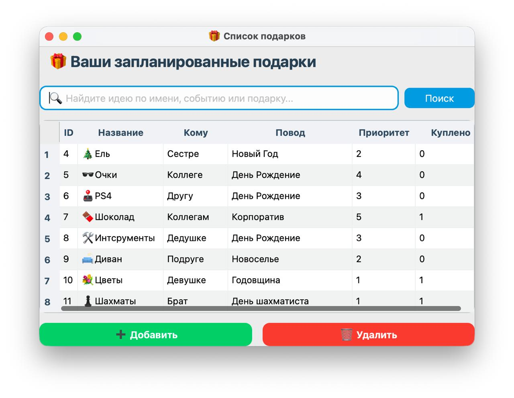
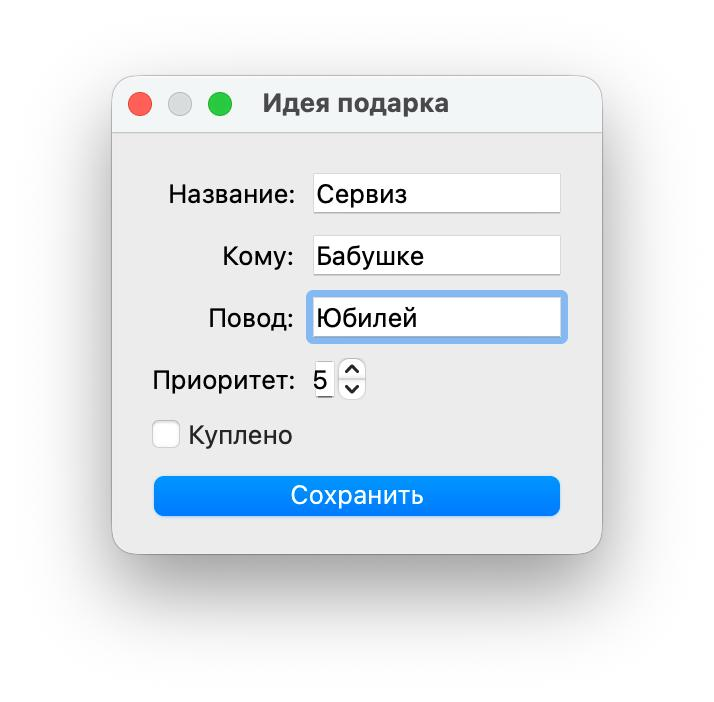

# GiftList — приложение для хранения идей подарков

**GiftList** — это настольное приложение на Python с использованием PyQt6 и SQLite.  
Оно предназначено для хранения и систематизации идей подарков для разных людей, событий и случаев.  
Каждой записи можно назначить приоритет, чтобы выделить более важные идеи.

---

## Основные возможности

- Добавление, редактирование и удаление записей (CRUD)
- Поиск и фильтрация данных
- Установка приоритета для каждой идеи подарка
- Хранение данных в локальной базе SQLite
- Удобный графический интерфейс на PyQt6
- Автоматическое создание базы данных при первом запуске

---

## Интерфейс




## Технологии

| Компонент | Назначение |
|------------|------------|
| Python 3.8+ | Язык программирования |
| PyQt6 | Фреймворк для создания графического интерфейса |
| SQLite | Реляционная база данных |
| Qt Designer | Инструмент для проектирования интерфейсов (.ui файлы) |

---

## Установка и запуск

1. Установите зависимости:
``bash
   pip install PyQt6
   ```bash
   pip install PyQt6
    ```
2. Запустите приложение:
python main.py
3. При первом запуске автоматически создается база данных gifts.db.

Структура проекта:
present_project/

├── main.py   

├── main_window.py

├── database.py

├── ui/

│   └── main_window.ui 

├── data/

└── gifts.db


Автор
Разработано в учебных целях для демонстрации работы с PyQt6 и SQLite.
Автор: SDV7
Год: 2025
